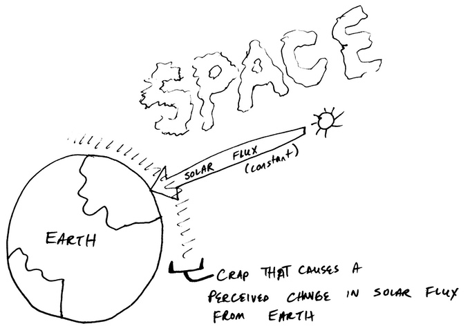

# ALIS: Aerosol Indicator for Self-Use

## Background: 
### Your health is impacted by the air you breathe.

Nearly half of the people in the United States (147.6 million) live with unhealthy air. 27.8 million of these people live in the 17 U.S. counties with the worst air pollution. China's toxic air is so bad that it is said to resemble 'a nuclear winter', killing plant-life and irreversibly harming animals and humans. Beijing's air quality is over 20x worse than what the World Health Organization (WHO) deems to be 'safe' air, making it almost 'uninhabitable' (Kaiman, 2014; Jing 2014). Despite a reduction in pollution levels, the Air Quality in Europe (2013) Report revealed that pollutants continue to be a source of cardiovascular disease and early death. Up to 96% of European city dwellers were exposed to fine particulate matter concentrations above the WHO guidelines. Paris' poor air quality alone may rival Beijing's. 

### Can air quality be monitored with smartphones (expensive devices you likely already own)?

Ok, taking a slight detour, in 2014, approximately 24% of the global population uses smartphones (64%of the population uses cell phones). This population spends $200-$400 per smart device. These smart phones are already capable of  incredible things, from GPS determination, heart rate monitoring, and high-resolution imagery. Can we leverage these devices, that most of us already own, to help inform us about the air we breathe? The answer is YES! 

We have developed the ALIS (pronounced Alice) app and hardware device to easily (cheaply!) provide an instant determination of the local air quality using a photo of the Sun. With minimal effort on your part (take a photo!), and minimal cost (<5% the cost of your phone), you can acquire a precisely calibrated, scientific measurement of air quality. The scientific data can be stored locally on your device or uploaded to a network of global 'citizenScientists'.

### Air Quality & the Sun?

Yes! Solar photometry is a widely used physics-based method to understand atmospheric clarity and visibility. The Sun's light is constant at the top of the atmosphere. Changes in the observed solar flux at the ground is a measurement of changes within the atmosphere. Using scientifically, peer-reviewed air quality algorithms, we translate these changes into air quality indices displayed on the phone with the app, color-coded for easy use.

Solar flux is constant at the top of the atmosphere. Perceived changes depends on what is going on between the ground and space.
Air quality sensors do exist but are sparse in location and can often only give daily average information. Air quality forecasts are based on models, which may or may not reflect your city's atmospheric information. Often, the worst air quality is in suburban regions, where no existing sensors are located. 

ALIS uses a technique implemented by both NASA and the Department of Energy's Atmospheric Radiation Measurement Climate Research Facility (ARM CART) to passively monitor pollution generated via aerosol particulates suspended in the atmosphere. 

## Benefits to you & your family.

Knowing the air quality index wherever you are at any time of day helps everyone on a variety of levels:

Medical - Asthmatics and those with respiratory ailments can determine medication use or plan ahead for travel based on global air quality reports. 
Children - Children are greatly impacted by poor air quality. Parents can assess the air quality index in realtime to determine whether playtime outside is safe. 
Elderly - Aside from children, the elderly are at greatest risk of suffering from upper respiratory distress due to poor air quality. Arm yourself with timely information.
Sports/Recreation - People that spend a lot of time outside exercising or even gardening can develop or exacerbate upper respiratory issues in locations with poor air quality. Map your air quality throughout the day to decide when it is best to head out.
Agricultural - Certain crops, vegetation, and livestock can be negatively impacted by poor air quality. Inform yourself in order to take action or prepare. 
Educational - Inform yourself, students, friends, and family about the air quality where you live. What is the science behind it? Can we do anything to make it better? Just because you can't always see poor air quality with your eyes, doesn't mean it isn't effecting you everyday.
Environmental - Data acquired could be used to modify or enhance existing national (e.g. NOAA, NASA) and international (e.g. EuroSkyRad) air quality monitoring networks .

## Notes:
iphone 5/6 objective c project for turngin your iphone into a sunphotometer. Requires additional hardware optics. Details to be uploaded.

[ALIS Kickstarter Video](https://www.kickstarter.com/projects/113253348/alis-a-personal-air-quality-monitor/widget/video.html "Original ALIS kickstarter video") 
